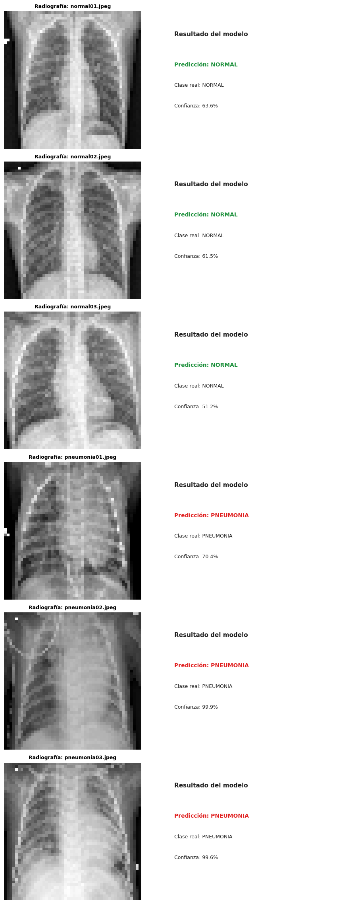

# Pneumonia Detection with Deep Learning

Proyecto de clasificación binaria de radiografías de tórax para detectar presencia de neumonía usando una red neuronal convolucional (CNN) implementada con TensorFlow/Keras.



## Resumen

Este repositorio contiene un flujo completo de trabajo para:

- Preparar datasets de imagen organizados por carpetas.
- Entrenar un modelo CNN para clasificar `NORMAL` vs `PNEUMONIA`.
- Guardar checkpoints del mejor modelo durante el entrenamiento.
- Monitorizar curvas y métricas en TensorBoard.
- Ejecutar inferencia sobre imágenes individuales para validar el comportamiento del modelo.

El objetivo es construir una base reproducible y clara para un caso real de computer vision en salud.

## Problema

La detección temprana de neumonía en radiografías puede apoyar decisiones clínicas. Este proyecto aborda el problema como una clasificación binaria:

- Clase `0`: `NORMAL`
- Clase `1`: `PNEUMONIA`

## Stack Tecnológico

- Python 3.x
- TensorFlow / Keras
- NumPy
- Pandas
- Scikit-learn
- TensorBoard

## Estructura del Proyecto

```text
Pneumonia_DeepLearning/
├── Pneumonia_detector_IA.ipynb    # Notebook principal
├── checkpoint.model.keras         # Mejor modelo guardado por callback
├── README.md
├── imagenes/
│   ├── train/
│   │   ├── NORMAL/
│   │   └── PNEUMONIA/
│   ├── val/
│   │   ├── NORMAL/
│   │   └── PNEUMONIA/
│   ├── test/
│   │   ├── NORMAL/
│   │   └── PNEUMONIA/
│   └── imagenes_testing/
│       ├── NORMAL/
│       └── PNEUMONIA/
└── logs/                           # Registros para TensorBoard
```

## Arquitectura del Modelo

El notebook implementa una CNN para clasificación binaria con:

- Bloques convolucionales + pooling para extracción de características.
- Capas `Dropout` para reducir overfitting.
- Capa densa intermedia (128 neuronas) y salida sigmoide de 1 neurona.

Configuración de entrenamiento principal observada en el proyecto:

- Optimizador: `Adam`
- Loss: `binary_crossentropy`
- Épocas máximas: `50`
- Callbacks:
	- `EarlyStopping`
	- `ReduceLROnPlateau`
	- `ModelCheckpoint`
	- `TensorBoard`

## Instalación

1. Clona el repositorio.
2. Instala dependencias.

```bash
pip install tensorflow tensorboard pandas numpy scikit-learn
```

## Cómo Ejecutar

### 1) Entrenamiento

- Abre el notebook `Pneumonia_detector_IA.ipynb`.
- Ejecuta las celdas en orden para cargar datos, entrenar y guardar el mejor checkpoint.

### 2) Monitorización con TensorBoard

Desde el notebook o terminal:

```bash
tensorboard --logdir ./logs/
```

### 3) Inferencia

El notebook incluye funciones para cargar imágenes, redimensionarlas y obtener predicción + confianza para casos de prueba.

## Buenas Prácticas Incluidas

- Separación de datos en `train`, `val` y `test`.
- Guardado del mejor modelo por validación.
- Parada temprana para evitar entrenamiento innecesario.
- Seguimiento de métricas de entrenamiento/validación.